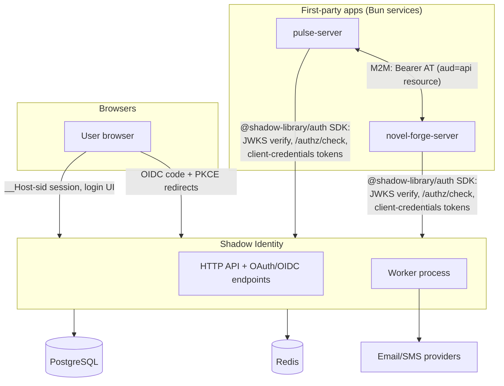
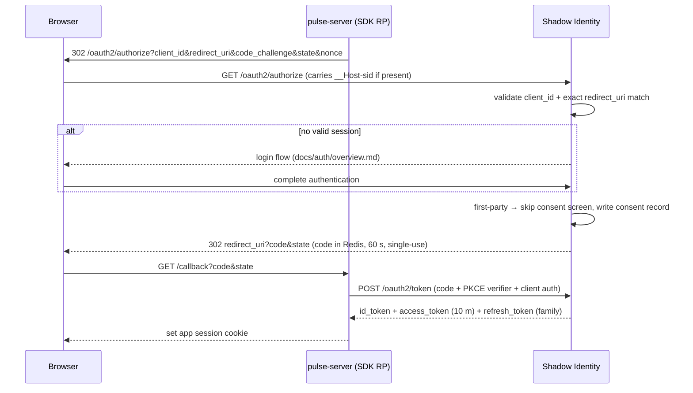
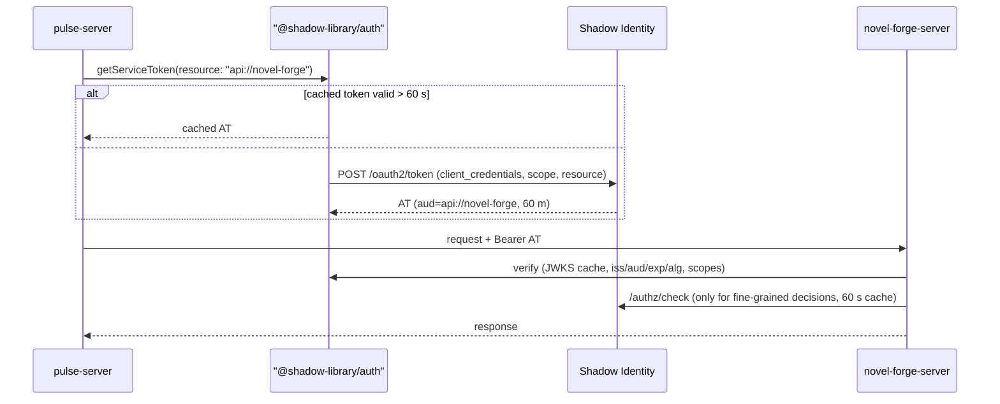
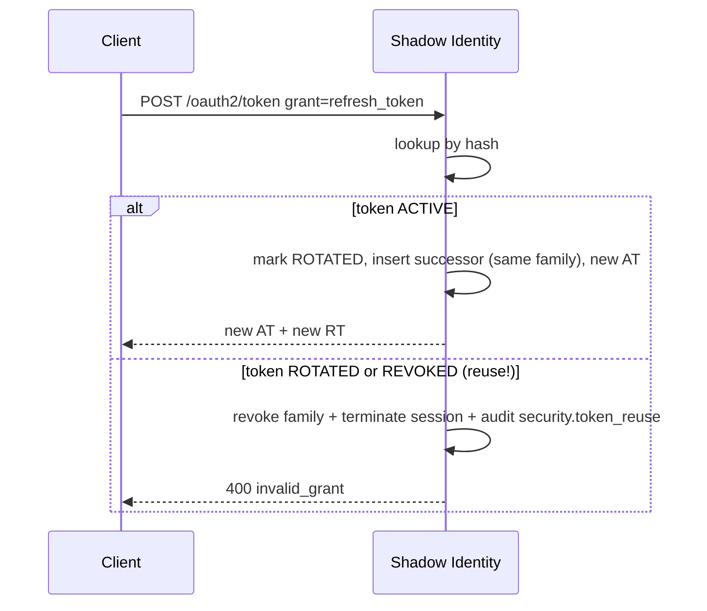
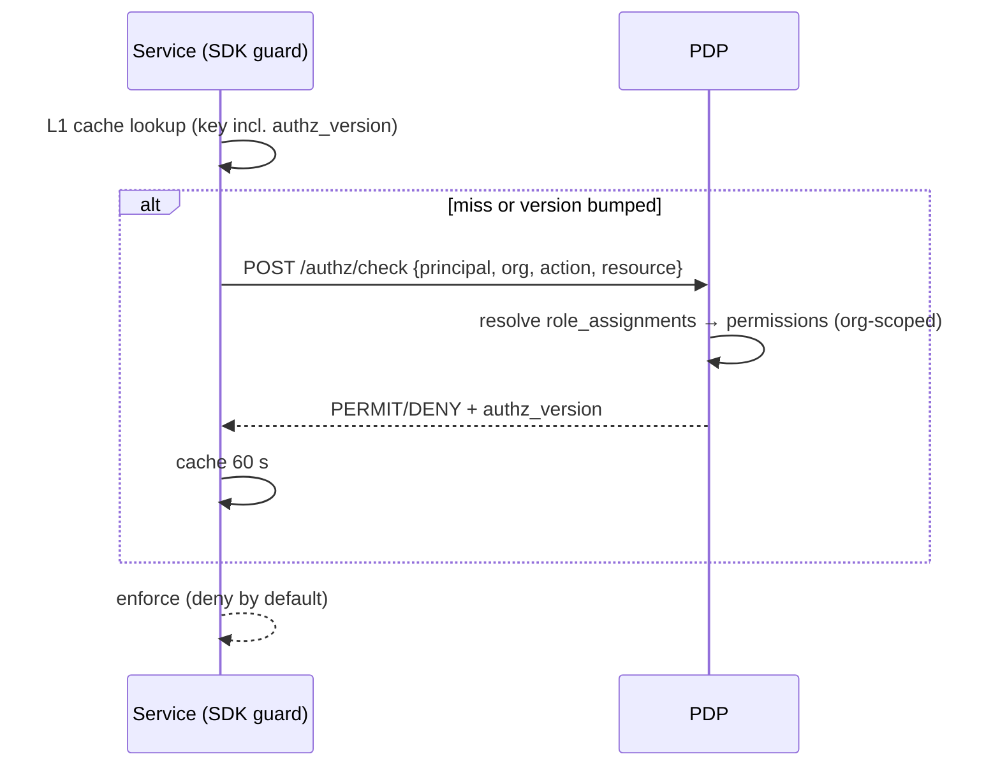
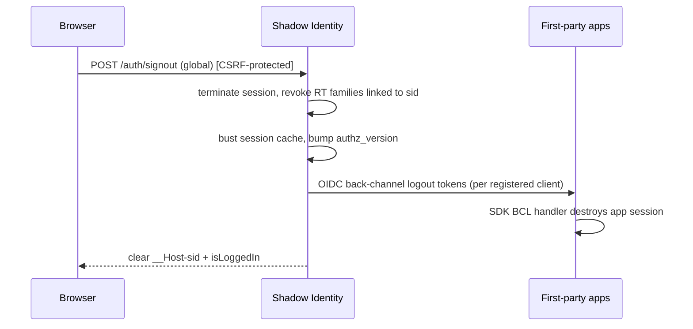

# Shadow Identity — Target Architecture Specification

|                  |                                                                                                                                                |
| :--------------- | :--------------------------------------------------------------------------------------------------------------------------------------------- |
| **Status**       | Approved for development                                                                                                                       |
| **Version**      | 1.0.0                                                                                                                                          |
| **Last updated** | 2026-07-11                                                                                                                                     |
| **Supersedes**   | The SSO and token-rotation designs previously described in `docs/auth/overview.md` (§E and conditional rotation in §D of the pre-1.0 revision) |

The key words **MUST**, **MUST NOT**, **SHOULD**, **SHOULD NOT**, and **MAY** are to be interpreted as described in RFC 2119.

## Document map

| Document                               | Contents                                                                             |
| :------------------------------------- | :----------------------------------------------------------------------------------- |
| `docs/architecture.md` (this document) | Target architecture, decisions, trust model, token model, module boundaries          |
| `docs/database.md`                     | Target data model: entities, constraints, tenancy rules, lifecycle states, retention |
| `docs/auth/overview.md`                | Interactive authentication flow specification (registration, login, recovery, MFA)   |
| `docs/auth/api-contract.md`            | HTTP API contract for the interactive authentication flows                           |
| `docs/sdk.md`                          | Specification of the `@shadow-library/auth` client package for consuming services    |
| `docs/tasks.md`                        | Development backlog: milestones, tasks, detailed change lists, acceptance criteria   |
| `docs/standards.md`                    | Cross-cutting engineering conventions (IDs, error codes, localization)               |

---

## 1. Purpose and scope

Shadow Identity is the centralized identity, authentication, and authorization platform for the Shadow Apps ecosystem. It is the **only** component in the ecosystem that stores credentials, issues tokens, or answers authorization questions.

It acts as:

1. The account system and user directory for all first-party applications.
2. An **OpenID Connect identity provider** and **OAuth 2.1 authorization server** for interactive (human) logins to first-party applications.
3. The **machine-to-machine (M2M) identity provider** for all service-to-service calls inside the ecosystem (client credentials grant).
4. The central **policy decision point (PDP)** for role- and permission-based authorization.
5. The session-management and security control plane (device list, remote logout, sign-in history).

Out of scope for the current phase, but explicitly planned for (see §14): SAML 2.0 IdP, inbound enterprise federation (customer IdPs), SCIM provisioning, verified custom domains, third-party (external developer) OAuth clients, and multi-region data residency.

## 2. Definitions

| Term                   | Meaning                                                                                                   |
| :--------------------- | :-------------------------------------------------------------------------------------------------------- |
| **Principal**          | Any authenticated actor: a user or a service account                                                      |
| **Organisation**       | Tenant boundary. Every principal and every tenant-owned row belongs to exactly one organisation           |
| **Personal workspace** | The synthetic organisation created for every user at registration (Decision D-1)                          |
| **Application**        | A logical product in the ecosystem (e.g. Pulse, Novel Forge). Owns OAuth clients, API resources, roles    |
| **OAuth client**       | A registered credentialed entity that can request tokens: browser app, server app, or service account     |
| **API resource**       | A protected API surface identified by a URI, used as the token `aud`ience                                 |
| **PDP / PEP**          | Policy decision point (identity service) / policy enforcement point (each consuming service, via the SDK) |
| **First-party**        | Built and operated by us; trusted to bypass the consent screen but never the protocol                     |

## 3. Architectural decisions

Decisions are binding. Changing one requires updating this document first.

| ID       | Decision                                                                                                                                                                                                                                                                                                                                                                                                                                                                                                                                                                     | Rationale / consequences                                                                                                                                                                                    |
| :------- | :--------------------------------------------------------------------------------------------------------------------------------------------------------------------------------------------------------------------------------------------------------------------------------------------------------------------------------------------------------------------------------------------------------------------------------------------------------------------------------------------------------------------------------------------------------------------------- | :---------------------------------------------------------------------------------------------------------------------------------------------------------------------------------------------------------- |
| **D-1**  | Every user gets a **synthetic personal workspace** (an `organisations` row of type `PERSONAL`) at registration. Every tenant-owned row carries `organisation_id NOT NULL`.                                                                                                                                                                                                                                                                                                                                                                                                   | One uniform tenancy rule; no nullable-tenant special cases; retrofit-free path to enterprise orgs and to data residency (org is the residency/shard unit).                                                  |
| **D-2**  | Service-to-service authentication uses **OAuth 2.0 client credentials** with short-lived JWT access tokens issued by this service. Service accounts are OAuth clients (`kind = SERVICE`). No static API keys, no mTLS mesh.                                                                                                                                                                                                                                                                                                                                                  | One token format and one verification path for human and machine calls; SDK handles acquisition/caching. mTLS rejected: no mesh infrastructure, no threat-model justification yet.                          |
| **D-3**  | Access tokens carry **identity, tenant, audience, and scopes only — never roles or permissions**. Permissions are resolved at the PDP per request and cached briefly by the SDK.                                                                                                                                                                                                                                                                                                                                                                                             | Bounded revocation latency (≤ cache TTL); small stable tokens; no stale-authorization class of bugs. Cost: one extra (cached) call per unique decision.                                                     |
| **D-4**  | First-party clients **bypass the consent screen but never the protocol**: full Authorization Code + PKCE with registered exact-match redirect URIs. The bespoke `/sso/authorize` design is **withdrawn**.                                                                                                                                                                                                                                                                                                                                                                    | Consent UX without redirect/token-leak vulnerabilities; third-party support later is additive (enable consent screen).                                                                                      |
| **D-5**  | All authentication and protocol logic is implemented **in this repository**, on top of the `@shadow-library` framework. The framework provides transport, DI, validation, caching, and state machines — it is not and will not become an IdP. The consumer package **`@shadow-library/auth`** (see `docs/sdk.md`) gives consuming services verification, guards, and token management; it lives in this repo as the workspace package `packages/auth` because server and SDK share protocol logic and the SDK is integration-tested against the real server on every commit. | Framework stays generic; auth logic centralized here; consumers never hand-roll auth.                                                                                                                       |
| **D-6**  | Caching uses `@shadow-library/modules` **`CacheModule`** (L1 in-process LRU + L2 Redis). Memcached is removed. Redis is a **required** dependency.                                                                                                                                                                                                                                                                                                                                                                                                                           | One cache stack; Redis is already required for flow state, rate limits, and revocation.                                                                                                                     |
| **D-7**  | Data residency is **deferred but designed for**: UUIDv7 primary keys (no global sequences), `organisation_id` on every tenant row (shard/region key), `region` column on `organisations` and `users` (single value `default` for now), no cross-tenant JOINs outside the directory index, and a minimal global "identifier → user/region" lookup path kept separable from PII.                                                                                                                                                                                               | When residency is required, tenants move as units; no key-space or query rewrites.                                                                                                                          |
| **D-8**  | Primary keys are **UUIDv7** (`Bun.randomUUIDv7()`), stored as `uuid`. External representations are prefixed per `docs/standards.md` (`usr_…`, `org_…`, `sess_…`). Bigserial keys are abolished.                                                                                                                                                                                                                                                                                                                                                                              | Time-ordered (index-friendly), region-portable, non-enumerable externally, consistent with the ID-prefix standard.                                                                                          |
| **D-9**  | Token signing uses **EdDSA (Ed25519)** with `kid`-addressed keys published via JWKS. Private keys are stored encrypted (AES-256-GCM envelope) under a master key-encryption key; the key provider is an interface so a KMS/HSM can replace env-based KEK without schema changes. Verifiers MUST enforce an algorithm allowlist of exactly `EdDSA`.                                                                                                                                                                                                                           | Fast, small signatures; native WebCrypto support in Bun; algorithm-confusion attacks precluded by allowlisting. ES256 is the designated fallback if a future third-party integration cannot verify Ed25519. |
| **D-10** | Browser authentication to the identity service itself uses an **opaque, server-side session** (`__Host-sid` cookie), not JWT cookies. JWTs exist only as OAuth/OIDC artifacts issued to clients.                                                                                                                                                                                                                                                                                                                                                                             | Instant revocation for the control plane; CSRF surface bounded; JWT lifetime problems don't apply to the primary session.                                                                                   |
| **D-11** | Refresh tokens are opaque, stored hashed, and **rotate on every use** with family-based reuse detection: presenting any revoked family member revokes the family and its session. The previously documented conditional rotation is withdrawn.                                                                                                                                                                                                                                                                                                                               | Restores the theft-detection property rotation exists for.                                                                                                                                                  |
| **D-12** | Identity-probing endpoints return **neutral responses** (no account-existence oracle): registration, recovery, and login-init behave identically for known and unknown identifiers.                                                                                                                                                                                                                                                                                                                                                                                          | Enumeration resistance. Residual risk (timing, method lists) documented in §11.                                                                                                                             |
| **D-13** | Deployment is a **modular monolith** plus a worker process, one PostgreSQL, one Redis. Background jobs use a Postgres-backed queue (`FOR UPDATE SKIP LOCKED`). No message broker until job volume proves the need.                                                                                                                                                                                                                                                                                                                                                           | Matches team size and scale; the transactional boundary is the tenant-isolation boundary.                                                                                                                   |
| **D-14** | The repo's local `DatastoreService` is replaced by `@shadow-library/modules` **`DatabaseModule`** (≥ 0.5), which lifecycle-manages Postgres/Redis clients.                                                                                                                                                                                                                                                                                                                                                                                                                   | Removes duplicated client management and the unsafe local SQL param-interpolating logger.                                                                                                                   |

## 4. System context

Trust boundaries: (1) public internet ↔ identity HTTP API; (2) identity service ↔ its datastores (private network only); (3) consuming services trust identity **only** via signed tokens and the PDP API — never via shared database access. No service other than identity may read or write identity's database.

## 5. Architectural style and processes

A **modular monolith** (D-13) with two deployable processes built from the same codebase:

1. **API process** — all synchronous HTTP: account APIs, auth flows, OAuth/OIDC endpoints, PDP, admin APIs.
2. **Worker process** — queue consumers: notification dispatch, key rotation, session/token/challenge expiry sweeps, audit chain maintenance, lockout evaluation.

Both are stateless; all state lives in PostgreSQL (durable) and Redis (ephemeral: flows, rate limits, caches, revocation marks). Horizontal scaling of the API process MUST be assumed in all designs — **no in-process state may be authoritative** (this retires the current `ApplicationService` in-memory `Map`).

### 5.1 Hosted web client (T-603)

The interactive UI (login, registration, recovery, consent, account management) is a React SPA in `client/`, built on `@shadow-library/ui` and **served by the API process itself** — `oauth.login-url` points back at this service, so the IdP owns its own front door and no separate frontend deployment exists. Placement rationale: the pages are pure consumers of the same-origin `/api/v1` surface (cookies + CSRF double-submit), so co-locating them removes CORS, token hand-off, and deployment-skew concerns entirely.

Build wiring: `scripts/build-client.ts` bundles `client/main.tsx` with `Bun.build` into `public/` (fonts ship as files — Bun's CSS bundler would otherwise inline them as data URLs); `scripts/build.ts` embeds `public/` into `dist/` so one image serves both. Serving: `UiController` answers the SPA shell with `cache-control: no-store` on the page routes; `@fastify/static` (registered through `FastifyModule`'s `fastifyFactory`) serves `/assets/*` long-cached. CSP stays `script-src 'self'` (the shell carries no inline script); `style-src` allows inline because the Radix primitives inside `@shadow-library/ui` position overlays with style attributes; `img-src` allows `data:` for the locally rendered TOTP QR code.

## 6. Module map

Modules live under `src/modules/`. A module may only touch another module's tables through that module's exported services.

| Module               | Path                            | Owns (aggregates)                                                                        | Notes                                       |
| :------------------- | :------------------------------ | :--------------------------------------------------------------------------------------- | :------------------------------------------ |
| Directory            | `identity/user`                 | User, Profile, Email, Phone, AuthIdentity                                                | Exists; must be repaired (see tasks M0)     |
| Credentials          | `identity/credentials`          | PasswordCredential (+history), MFAEnrollment, WebAuthnCredential, RecoveryCode           | New                                         |
| Auth flows           | `auth/flow`                     | AuthFlow (Redis, via `FlowManager` from `@shadow-library/common`), VerificationChallenge | New                                         |
| Sessions             | `auth/session`                  | Session, Device, RefreshTokenFamily, RefreshToken                                        | New                                         |
| Authorization server | `auth/oauth`                    | OAuthClient, RedirectUri, AuthorizationCode (Redis), Consent, Scope, APIResource         | New                                         |
| Key management       | `auth/keys`                     | SigningKey, JWKS, KeyProvider                                                            | New                                         |
| PDP                  | `authz`                         | Role, Permission, RoleAssignment, decision API                                           | New                                         |
| Tenancy              | `identity/organisation`         | Organisation, Membership, Invitation                                                     | New (schema exists, no code)                |
| Applications         | `system/application`            | Application, ApplicationRole                                                             | Exists; extended with client/resource links |
| Notifications        | `infrastructure/notification`   | outbox, provider adapters (email now, SMS later)                                         | New                                         |
| Audit                | `infrastructure/audit`          | AuditEvent, SignInEvent writer                                                           | New                                         |
| Jobs                 | `infrastructure/jobs`           | queue tables, worker runtime                                                             | New                                         |
| Datastore            | `infrastructure/datastore`      | replaced by `DatabaseModule` (D-14); keeps Drizzle schemas                               | Refactor                                    |
| Web client           | `infrastructure/ui` + `client/` | SPA shell serving, static assets (§5.1)                                                  | New (M6, T-603)                             |

## 7. Identity and tenancy model

### 7.1 Principals

- **Users** — human accounts, globally unique verified email(s), optional username/phone.
- **Service accounts** — modelled as OAuth clients with `kind = SERVICE` and `grant_types = [client_credentials]`, owned by an application and scoped to an organisation (platform services live in the platform organisation). There is deliberately **no separate service-account table** — one client registry, one credential lifecycle, one audit trail.

### 7.2 Synthetic personal workspace (D-1)

At registration, in the same transaction as user creation:

1. Create `organisations` row: `type = PERSONAL`, `name` derived from profile, `region = 'default'`.
2. Create `organisation_members` row: `role = OWNER`, `is_default = true`.
3. `users.personal_organisation_id` references it (a user has exactly one personal org, ever).

Personal orgs MUST NOT be joinable by other users, deletable independently of the user, or convertible in place to team orgs (a team org is created and resources migrate — deferred capability).

### 7.3 Tenant-scoping invariant

Every tenant-owned table carries `organisation_id NOT NULL`. All reads and writes go through repositories that require an org context; a CI-enforced test suite (the _isolation harness_) attempts cross-tenant access on every tenant-scoped repository method and MUST fail the build on any leak. Caches, queue payloads, audit rows, and log context are all keyed/tagged with `organisation_id`.

## 8. Authentication architecture

### 8.1 Interactive flows

Registration, login, recovery, and step-up are state machines defined with `FlowManager`/`FlowRegistry` (`@shadow-library/common`) and persisted in Redis under `auth_flow:{flowId}` with a 15-minute TTL. The full specification is `docs/auth/overview.md`. Key properties:

- Neutral responses (D-12) on `register/init`, `login/init`, `recover/init`.
- Tiered brute-force controls (per-flow, per-identifier, per-IP, persistent account lock) — §11.
- On completion, flows produce a **session** (browser) — OAuth artifacts are only minted through the OAuth endpoints (§8.3).

### 8.2 Browser sessions with the identity service (D-10)

| Property         | Value                                                                                        |
| :--------------- | :------------------------------------------------------------------------------------------- |
| Cookie           | `__Host-sid` — `Secure; HttpOnly; SameSite=Lax; Path=/`                                      |
| Value            | Opaque 256-bit random, stored **hashed** (SHA-256) in `user_sessions`                        |
| Companion cookie | `isLoggedIn=true` — `Secure; SameSite=Lax`, **not** HttpOnly (client-side session hint only) |
| Idle timeout     | 30 days rolling (`last_used_at` refreshed at most once per 5 minutes)                        |
| Absolute timeout | 180 days (`expires_at`, fixed at creation)                                                   |
| Validation       | Redis-cached session lookup (60 s TTL) with explicit cache invalidation on revocation        |
| Fixation         | Session ID is issued only after authentication completes; re-login always issues a new ID    |
| Step-up          | `elevated_until` set after re-auth (password/MFA); sensitive operations require it (§8.5)    |

`SameSite=Lax` (not `Strict`) is required because OIDC redirects from app subdomains are top-level navigations that must carry the session cookie. CSRF protection therefore MUST NOT rely on SameSite alone: the `HttpCoreModule` CSRF double-submit is required on all state-changing browser endpoints, and the token MUST be HMAC-signed and compared in constant time (framework change — task T-012).

### 8.3 Application login — OIDC Authorization Code + PKCE (D-4)

First-party applications never touch credentials. Each app is a registered OAuth client:

- **Server-rendered / backend apps** (`pulse-server`, …): confidential clients; the SDK's RP helper runs code + PKCE server-side, then establishes the app's own session.
- **SPAs without backends**: public clients, code + PKCE, refresh tokens with rotation.
- PKCE (`S256`) is **mandatory for every client**, confidential included.
- Redirect URIs: exact string match against registered values. No wildcards, no substring logic, no open `redirectUri` parameters anywhere in the platform.
- Authorization codes: single-use, 60-second TTL, stored in Redis bound to client + redirect URI + PKCE challenge + session + nonce.
- First-party clients skip the consent screen; a consent record is still written (`source = FIRST_PARTY_POLICY`) so the data model does not change when third-party clients arrive.

### 8.4 Machine-to-machine authentication (D-2)

Every internal service holds a service-account client. Flow:

1. Service (via SDK) calls `POST /oauth2/token` with `grant_type=client_credentials`, its client ID + credential, requested `scope`, and `resource` (RFC 8707) identifying the target API resource.
2. Identity validates the client, checks the requested scopes against the client's **granted scopes** for that resource, and issues an access token: `aud` = resource identifier, `sub` = client ID, TTL 60 minutes.
3. The callee verifies the token locally (JWKS, `iss`, `aud`, `exp`, alg allowlist) via the SDK and enforces scopes; fine-grained decisions go to the PDP.

Client authentication methods: `client_secret_basic` (default; secret stored argon2id-hashed, rotatable with dual-secret overlap) and `private_key_jwt` (RFC 7523) for higher-trust services using per-client public keys registered in `application_keys` — this is now the **defined purpose** of that table. Service-account tokens are cached by the SDK until 60 s before expiry (singleflight refresh).

### 8.5 MFA and step-up

- Methods: TOTP (RFC 6238, secret stored AES-GCM-encrypted), WebAuthn/passkeys (platform + roaming), email OTP as fallback, one-time recovery codes (argon2id-hashed, 10 per generation).
- Step-up: sensitive operations (credential changes, org deletion, client-secret reveal/rotation, admin actions) require `elevated_until` in the future; elevation lasts 10 minutes and requires re-auth with password or any enrolled MFA factor.
- Authentication assurance recorded per session: `aal1` (single factor) / `aal2` (MFA); OIDC ID tokens expose it via `acr`/`amr`.

## 9. Token model

| Token                    | Format         | Lifetime                                        | Storage                                      | Notes                                                             |
| :----------------------- | :------------- | :---------------------------------------------- | :------------------------------------------- | :---------------------------------------------------------------- |
| Identity-service session | Opaque 256-bit | 30 d idle / 180 d absolute                      | `user_sessions` (hashed) + Redis cache       | The only browser credential on the identity domain                |
| Access token (user)      | JWT (EdDSA)    | **10 minutes**                                  | Not stored server-side                       | `sub`, `org`, `aud`, `scope`, `sid`, `acr/amr`, `iat/exp/iss/jti` |
| Access token (M2M)       | JWT (EdDSA)    | 60 minutes                                      | Not stored                                   | `sub` = client ID, `aud` = API resource                           |
| ID token                 | JWT (EdDSA)    | 5 minutes                                       | Not stored                                   | OIDC claims + `nonce`; never used for API authorization           |
| Refresh token            | Opaque 256-bit | 30 d idle / 180 d absolute (bounded by session) | `refresh_tokens` (hashed), grouped by family | Rotates on every use (D-11)                                       |
| Authorization code       | Opaque         | 60 seconds, single-use                          | Redis                                        | Bound to client, redirect URI, PKCE, nonce, session               |

Rules:

- Tokens **never** appear in URLs, logs, or audit payloads. Refresh tokens and session IDs are stored as SHA-256 hashes only.
- Verifiers MUST validate `iss`, `aud`, `exp` (±60 s clock skew), signature against a `kid`-matched JWKS key, and the `EdDSA`-only algorithm allowlist.
- Access tokens contain no mutable authorization state (D-3). Revocation latency for access tokens is bounded by their 10-minute TTL; anything needing faster cutoff (session revocation, account suspension) is enforced via the PDP/session checks, which are cache-bounded at 60 s.
- User-facing refresh: a rotated family; reuse of any revoked member revokes the family **and** terminates the linked session, and emits a `security.token_reuse` event.

## 10. Cryptography and key management (D-9)

- `signing_keys` table: `kid` (UUIDv7), `alg = EdDSA`, public JWK, private key ciphertext (AES-256-GCM), KEK version, state machine `PENDING → ACTIVE → RETIRING → RETIRED`.
- Exactly one `ACTIVE` signing key; `PENDING` is published in JWKS before activation (pre-publication window ≥ 24 h so consumer caches warm); `RETIRING` keys remain published until every token they signed has expired, then become `RETIRED` (unpublished, retained for audit).
- Rotation cadence: 90 days, executed by a worker job; manual emergency rotation MUST be a single admin action that generates, pre-publishes, activates, and retires in an accelerated but ordered sequence.
- KEK: 32-byte key from `MASTER_ENCRYPTION_KEY` env secret initially, behind a `KeyProvider` interface (`encrypt`, `decrypt`, `kekVersion`) so KMS/HSM replaces it without data migration beyond re-wrapping.
- JWKS endpoint (`/.well-known/jwks.json`) serves public keys with `Cache-Control: max-age=300`; the SDK caches with automatic refresh on unknown `kid` (bounded retry).
- All other secrets at rest (TOTP seeds, client secrets where reversible storage is not needed → hash instead) follow the same envelope pattern. No custom cryptographic constructions anywhere; primitives come from WebCrypto/`node:crypto` and `Bun.password`.
- Password hashing: argon2id via `Bun.password` with **pinned** parameters (`memoryCost: 65536`, `timeCost: 3`), parameters recorded per credential row; verify-time rehash upgrades on parameter change.

## 11. Authorization (PDP/PEP)

- **Model**: RBAC. Applications define `permissions` (strings, e.g. `posts:write`) and `application_roles` mapping to permission sets. Roles are assigned to principals via `role_assignments`, always scoped to an organisation. Org administration itself uses the fixed membership roles (OWNER/ADMIN/MEMBER); fine-grained product access uses role assignments. ReBAC/ABAC are deliberately excluded until a product feature requires resource-level sharing.
- **Decision API**: `POST /api/v1/authz/check` — `{ principal, organisation, action, resource? }` → `{ decision: PERMIT | DENY, reasons[] }`, plus a batch variant. Deny by default; deny always wins.
- **Enforcement**: every consuming service uses the SDK's guard (`@RequirePermission('posts:write')`) which calls the PDP with an L1 cache (60 s TTL, LRU). The identity service uses the same PDP internally for its admin APIs — one decision path everywhere (APIs, workers, future WebSockets).
- **Invalidation**: grant changes bump a per-principal `authz_version` (Redis); cached decisions embed the version and are discarded on mismatch. Worst-case staleness = SDK cache TTL (60 s).
- **Auditability**: assignments and role/permission changes are audit events; the PDP MAY sample-log decisions (never bodies) for debugging.
- **Enumeration-adjacent residual risks** (accepted, documented): available-method lists during login differ per account; response-timing differences are mitigated by constant-work lookups where practical.

## 12. Protocol surface

All standard endpoints; no dynamic client registration, no implicit flow, no ROPC, ever.

| Endpoint                                | Purpose                                                                            |
| :-------------------------------------- | :--------------------------------------------------------------------------------- |
| `GET /.well-known/openid-configuration` | Discovery metadata                                                                 |
| `GET /.well-known/jwks.json`            | Public signing keys                                                                |
| `GET /oauth2/authorize`                 | Authorization Code + PKCE entry                                                    |
| `POST /oauth2/token`                    | `authorization_code`, `refresh_token`, `client_credentials`                        |
| `POST /oauth2/revoke`                   | RFC 7009 revocation (RT families, client tokens)                                   |
| `POST /oauth2/introspect`               | RFC 7662, confidential clients only (SDK fallback when local verify is impossible) |
| `GET /oauth2/userinfo`                  | OIDC UserInfo                                                                      |
| `GET /oauth2/logout`                    | RP-initiated logout                                                                |
| `POST` back-channel logout              | OIDC BCL logout tokens pushed to registered client endpoints                       |

Conformance: the OpenID Foundation conformance suite (OP Basic + Config profiles) runs in CI-adjacent tooling before the OIDC milestone exits (task T-309).

## 13. Platform services

### 13.1 Caching (D-6)

`CacheModule` provides L1 (in-process LRU, small TTLs) + L2 (Redis). Cacheability rules:

| Data                            | Cache   | TTL                         | Invalidation                 |
| :------------------------------ | :------ | :-------------------------- | :--------------------------- |
| JWKS / discovery                | L1 + L2 | 300 s                       | key rotation republish       |
| Session lookup (hash → session) | L2      | 60 s                        | explicit delete on revoke    |
| PDP decisions                   | SDK L1  | 60 s                        | `authz_version` bump         |
| Client/app registry             | L1 + L2 | 300 s                       | explicit bust on admin write |
| Auth flow state                 | L2 only | 900 s (TTL = flow lifetime) | terminal state delete        |
| Rate-limit counters             | L2 only | window-scoped               | —                            |

Credentials, tokens, and PII MUST NOT be cached beyond the entries above. All keys embed `organisation_id` where tenant-scoped.

### 13.2 Rate limiting and abuse

Four tiers (Redis, fail-closed for auth endpoints, fail-open for read APIs). Implemented by the
`SecurityModule` rate-limit middleware (`@RateLimit`-decorated routes fail closed on a Redis
outage; undecorated routes carry only the general budget and fail open):

1. **IP**: general 100 req/min on every route; `register/init` and `recover/init` 5/h; `login/init` 20/h; `webauthn/options` 60/h; `challenge/resend` 10/h. A dynamic deny list (`rl:ipblock:*`) rejects blocked IPs outright; `RATE_LIMIT_IP_ALLOWLIST` bypasses infrastructure IPs and `RATE_LIMIT_ENABLED` is the kill switch.
2. **Identifier**: OTP resends max 3 per flow with a 60 s cooldown; deliveries max 5 per identifier per hour across all flows, enforced inside `ChallengeService.issue` (exceeding it silently skips delivery — anti-bombing without an enumeration signal).
3. **Flow**: max 3 failed credential submissions per flow → flow terminated (410).
4. **Persistent account lock**: ≥ 5 `INVALID_CREDENTIALS`/`MFA_FAILED` events in 15 min → `users.lock_mode = OTP_ONLY` with `locked_until`; the password step refuses while locked, OTP methods keep working.

### 13.3 Audit and security events

- `audit_events`: append-only, **no foreign keys**, hash-chained per organisation (`hash = SHA-256(prev_hash || canonical_row)`). Fields: actor (type/ID), organisation, action, target, outcome, IP, correlation ID (`request.cid` from the framework), redacted JSONB detail.
- Everything privileged is audited: auth events, credential changes, grants, client/key changes, admin actions, consent changes, token/session revocations.
- `sign_in_events` is the authentication-specific log; `user_id` is nullable with `ON DELETE SET NULL` so failed attempts against unknown identifiers and deleted users' histories survive.
- Retention: audit 400 days minimum, sign-in events 400 days; right-to-erasure scrubs PII columns but preserves the chained skeleton. Audit storage is separate from operational logs (which go through `Logger` transports).
- **Security event taxonomy** — audit actions under the `security.*` prefix, each mirrored by a structured log line tagged `securityEvent` so alerting keys off one name:
  | Event | Trigger | Automatic response |
  | :--- | :--- | :--- |
  | `security.token_reuse` | rotated refresh token presented again | family + session revoked |
  | `security.new_device_login` | successful login from a device/IP unseen for the account | alert email via outbox (`security.new-signin`) |
  | `security.ip_blocked` | ≥ 30 failed logins from one IP in 15 min (cross-account) | IP temp-blocked for 1 h at Tier-1 |
  | `security.otp_flooding` (log only) | identifier OTP budget exceeded | delivery suppressed |
  GeoIP / impossible-travel signals require an external location database and are deferred (tasks M5 notes). Alerts on key-rotation failure and audit-chain breaks are monitoring rules over these logs.

### 13.4 Notifications

Provider-agnostic `NotificationModule`: templated email (verification, OTP, security alerts) via a transactional outbox (`notification_outbox` table) drained by the worker — an email is never sent from inside a request transaction that might roll back. SMS is a later adapter behind the same interface. Provider failover is a config-level second adapter.

### 13.5 Background jobs (D-13)

Postgres queue (`jobs` table, `FOR UPDATE SKIP LOCKED`, per-type concurrency, exponential backoff, dead-letter state, idempotency keys). Initial jobs: notification dispatch, key rotation, expiry sweeps (sessions, tokens, challenges, flows), lockout release, audit-chain verification, HIBP password-breach checks.

## 14. Deferred capabilities (design-compatible, not built)

These MUST NOT be built now, but current decisions keep them additive: SAML 2.0 IdP; inbound OIDC/SAML federation with home-realm discovery (schema reserves `identity_providers`, `organisation_domains`); SCIM 2.0 (+`scim_tokens`); webhooks/event streams (`webhook_subscriptions`); third-party clients + consent screens + publisher verification; team organisations with invitations UI; risk-based/adaptive auth; multi-region residency (activated by D-7 groundwork); DPoP/mTLS sender-constrained tokens.

## 15. Deployment and operations

- **Config**: fail-closed — production boot MUST abort if `PRIMARY_DATABASE_URL`, `REDIS_URL`, or `MASTER_ENCRYPTION_KEY` are missing. Development-only defaults are gated on `Config.isDev()`. `.env.example` lists every variable.
- **Migrations**: `drizzle-kit` from the corrected schema path; every schema change lands with its migration in the same PR; CI fails if `drizzle-kit generate` produces a diff. Migrations MUST be expand/contract (zero-downtime): additive first, backfill via worker, contract later.
- **Health**: `/health` (liveness, exists) plus `/health/ready` (Postgres + Redis + active signing key present).
- **Graceful shutdown**: drain HTTP, finish in-flight jobs, close DB/Redis (provided by `DatabaseModule` lifecycle, D-14).
- **Observability**: structured JSON logs with `cid`, metrics (auth success/failure rates, token issuance, PDP latency, queue depth, rate-limit hits), alerts on: token-reuse detections, admin actions, key-rotation failure, audit-chain verification failure.
- **Backups/DR**: nightly logical backups + WAL archiving; quarterly restore drill; RPO ≤ 5 min, RTO ≤ 1 h (single region).
- **Container**: non-root Bun image (version-pinned tag; CI pins the digest via `--build-arg BUN_IMAGE`), `HEALTHCHECK` on `/health`, prebuilt `dist/` only (no toolchain in the image); production writes no files, so a read-only rootfs is safe. The worker runs the same image with `worker.js`. Operational procedures live in `docs/runbooks.md`.

## 16. Framework component mapping

| Need                                     | Component                                                    | Source                         |
| :--------------------------------------- | :----------------------------------------------------------- | :----------------------------- |
| DI, modules, lifecycle                   | `ShadowFactory`, `@Module`, `OnModuleInit/Destroy`           | `@shadow-library/app`          |
| HTTP routing, middleware, error envelope | `HttpController`, `Get/Post/…`, `@Middleware`, `ServerError` | `@shadow-library/fastify`      |
| Request validation / DTO schemas         | class decorators → AJV                                       | `@shadow-library/class-schema` |
| Flow state machines                      | `FlowManager`, `FlowRegistry`                                | `@shadow-library/common`       |
| Config, logging, errors                  | `Config`, `Logger`, error classes                            | `@shadow-library/common`       |
| L1+L2 cache                              | `CacheModule`                                                | `@shadow-library/modules`      |
| DB/Redis clients + lifecycle             | `DatabaseModule` (≥ 0.5)                                     | `@shadow-library/modules`      |
| Health, OpenAPI docs, CSRF, helmet       | `HttpCoreModule`                                             | `@shadow-library/modules`      |
| Login/account UI components              | React components                                             | `@shadow-library/ui`           |
| Consumer-side auth                       | **`@shadow-library/auth` (new)**                             | `docs/sdk.md`                  |

## 17. Sequence diagrams

### 17.1 Interactive OIDC login (first-party app)

### 17.2 Machine-to-machine call

### 17.3 Refresh-token rotation and reuse detection

### 17.4 Fine-grained authorization decision

### 17.5 Logout and global revocation

