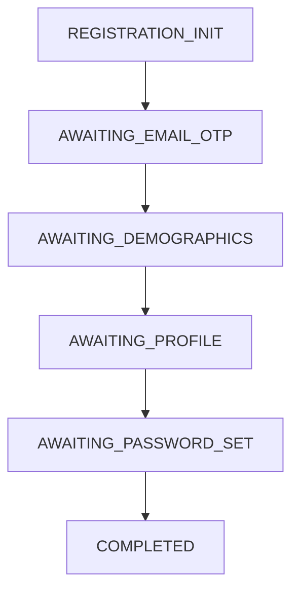
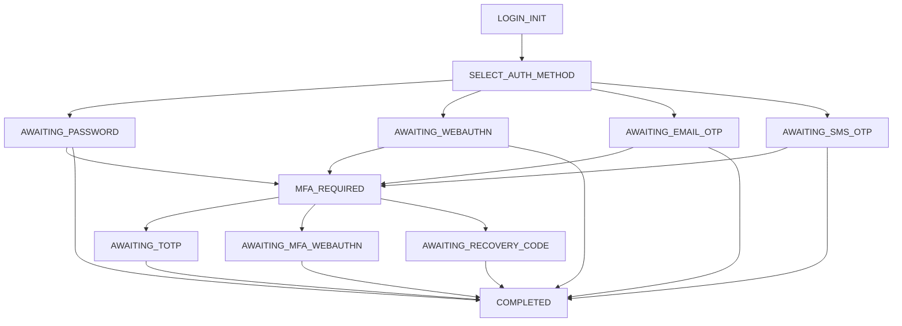
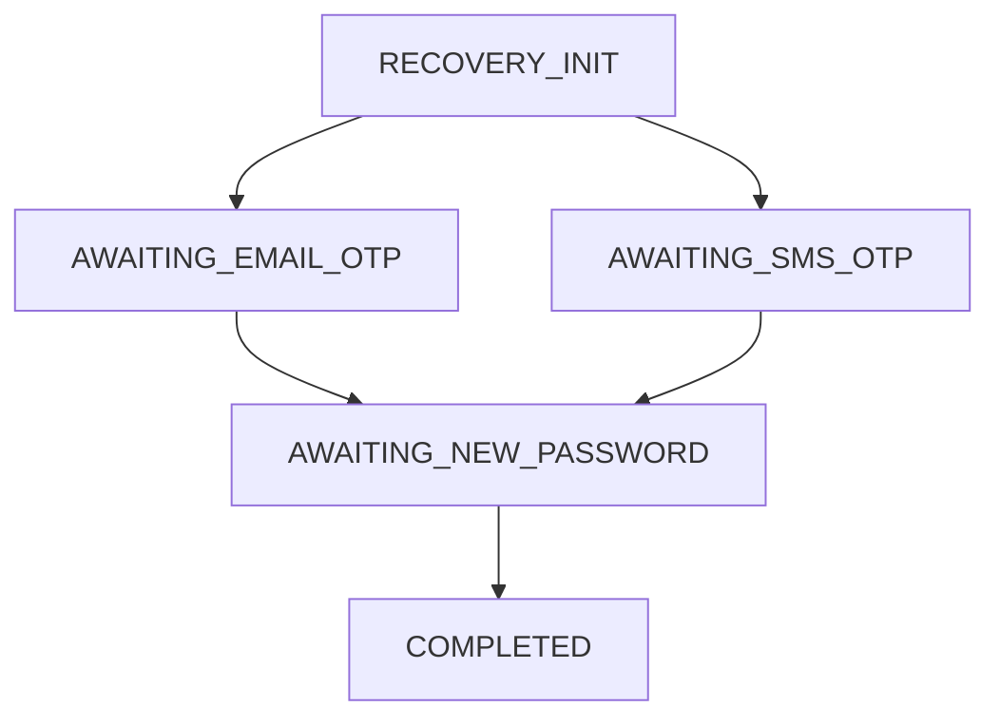

# Shadow Identity — Interactive Authentication Flow Specification

| | |
| :--- | :--- |
| **Status** | Approved for development |
| **Version** | 2.0.0 |
| **Last updated** | 2026-07-11 |
| **Supersedes** | v1 of this document. The bespoke first-party SSO protocol (former §E) is **withdrawn** in favour of OIDC Authorization Code + PKCE (`docs/architecture.md` §8.3, decision D-4). Conditional refresh rotation (former §D) is **withdrawn** (decision D-11). |

This document specifies the browser-facing authentication flows executed on the identity domain. Application login is *not* specified here — applications obtain tokens exclusively through the OAuth/OIDC endpoints; these flows only establish the identity-domain session that `/oauth2/authorize` consumes.

## 1. Flow engine

Flows are state machines built on `FlowManager`/`FlowRegistry` from `@shadow-library/common`. The definition (states, transitions, guards) lives in code; Redis persists only the **flow context**.

| Property | Value |
| :--- | :--- |
| Redis key | `auth_flow:{flowId}` — `flowId` is UUIDv7, generated server-side |
| TTL | 15 minutes (`auth.flow.ttl`), refreshed on successful transitions only |
| Terminal handling | terminal states delete the key; expired flows require restarting |

### Flow context

| Field | Type | Description |
| :--- | :--- | :--- |
| `kind` | enum | `REGISTRATION · LOGIN · RECOVERY · STEP_UP` |
| `identifier` | string | as submitted (email/phone/username) |
| `userId` | string? | resolved internally; **never returned to the client** |
| `authMethod` / `mfaMethod` | enum? | populate `sign_in_events` on completion |
| `device` | object | fingerprint, IP, user agent |
| `regData` | object? | staged registration fields before the final commit |
| `failureCount` / `globalFailureCount` | int | limits 3 / 5 (Tier 3) |
| `resendCount` / `globalResendCount` | int | limits 3 / 5 |
| `challengeId` | string? | reference to the active `verification_challenges` row — **codes are stored hashed in Postgres, never in Redis** |
| `oidcResume` | object? | pending `/oauth2/authorize` request to resume after completion |

## 2. Enumeration neutrality (decision D-12)

All three `*/init` endpoints MUST be indistinguishable for known and unknown identifiers:

| Endpoint | Known identifier | Unknown identifier |
| :--- | :--- | :--- |
| `register/init` | 200, `AWAITING_EMAIL_OTP`; email sent: *"you already have an account — sign in"* (no OTP issued; any submitted code fails generically) | 200, `AWAITING_EMAIL_OTP`; OTP email sent |
| `login/init` | 200, `AWAITING_PASSWORD` (+ real method info at later states) | 200, `AWAITING_PASSWORD`; verification always returns `INVALID_CREDENTIALS` |
| `recover/init` | 200, masked destinations, OTP sent | 200, deterministically masked fake destination derived from the input; nothing sent; verification always fails |

Accepted residual risks: per-account method lists differ once a real password step is passed; timing differences are minimized with constant-work lookups (always execute one argon2id verification against a static dummy hash when the user is unknown).

## 3. Registration flow

1. **Init** (`POST /auth/register/init`) — email + device fingerprint. Creates flow; issues email OTP via `verification_challenges` + `notification_outbox`. Neutral per §2.
2. **Verify OTP** (`POST /auth/challenge/verify`) — hashed comparison, max 3 attempts per challenge, challenge TTL 10 min.
3. **Demographics** (`POST /auth/register/demographics`) — DOB (13 ≤ age ≤ 120), gender; staged in `regData`.
4. **Profile** (`POST /auth/register/profile`) — names; staged.
5. **Password** (`POST /auth/register/password`) — policy: length ≥ 8 (≤ 128), argon2id, breach-check (HIBP k-anonymity; soft-fail if provider down, queued for async re-check). *(New dedicated state: v1 committed users without any password step.)*
6. **Commit** — single transaction: `users` (status `ACTIVE`, email verified at creation), `user_profiles`, `user_emails` (`verified_at = now()`, primary), `user_auth_identities` (`PASSWORD`), `user_passwords`, **personal organisation + membership (D-1)**, `sign_in_events` (`SUCCESS`); then session creation (§6).

## 4. Login flow

- **Init** resolves the user internally, checks `lock_mode` (Tier 4): `OTP_ONLY` restricts offered methods to OTP; the response shape is identical either way.
- **Method listing/switching** (`GET /auth/challenge/methods`, `POST /auth/challenge/change`) per the API contract.
- **Verification** (`POST /auth/challenge/verify`): on failure — increment Tier-3 counters, write `sign_in_events` (`INVALID_CREDENTIALS`/`MFA_FAILED`), evaluate Tier 4; on success — either advance to MFA (if enrolled; sessions completing MFA record `AAL2`) or complete.
- **Completion** writes/updates the `sign_in_events` row (`id = flowId`, `SUCCESS`) and creates the session (§6). If `oidcResume` is present, respond with the resume redirect to `/oauth2/authorize`.

## 5. Recovery flow

- Neutral init per §2. OTP proves control of a **verified** email/phone.
- If the account has MFA enrolled, recovery additionally requires one MFA factor or a recovery code (**recovery MUST NOT silently downgrade MFA accounts to single-factor takeover**).
- Reset (`POST /auth/recover/reset`): password policy + history check (last 5); on success — update `user_passwords`, **revoke all sessions and refresh-token families** (`revoke_reason = ADMIN`… reason `PASSWORD_RESET`), send a security notification, create a fresh session (§6), finalize `sign_in_events`.

## 6. Session creation (all flows converge here)

In one transaction + cache operations:

1. Generate 256-bit session secret; store SHA-256 in `user_sessions` (`aal`, device, IP, UA snapshot; absolute `expires_at = now() + 180d`).
2. Upsert `devices` row from fingerprint; flag new devices → security email (worker).
3. Set cookies: `__Host-sid` (Secure, HttpOnly, SameSite=Lax, Path=/), `isLoggedIn=true` (Secure, SameSite=Lax, readable). **No JWT and no refresh token are set as cookies** — OAuth artifacts exist only via `/oauth2/*` (D-10).
4. Prime the Redis session cache.

Session semantics (idle 30 d, absolute 180 d, fixation, step-up `elevated_until`) are defined in `docs/architecture.md` §8.2.

## 7. Sign-out

- **Per-app sign-out** is an application concern (its own session) plus optional RP-initiated logout at `/oauth2/logout`.
- **Global sign-out** (`POST /auth/signout`, CSRF-protected): terminate the session row, revoke linked refresh-token families, bust the session cache, dispatch OIDC back-channel logout tokens to all registered clients with an active grant for this session, clear cookies.

## 8. Brute-force and abuse tiers

| Tier | Scope | Store | Policy |
| :--- | :--- | :--- | :--- |
| 1 | IP | Redis | 100 req/min general; `register/init` 5/h; `login/init` 20/h; fail-closed |
| 2 | Identifier | Redis | OTP sends: 3/flow, 5/identifier/hour |
| 3 | Flow | Redis (flow context) | 3 failures per method, 5 total → flow terminated (`410`), event logged |
| 4 | Account (persistent) | PostgreSQL | ≥ 5 failed events in 15 min → `lock_mode = OTP_ONLY`, `locked_until = now() + 15m`; evaluated in the same transaction as the failure insert; success does not reset history but naturally ends the window |

All limits return machine-readable codes with `retryAfterSeconds` (never prose), per `docs/standards.md`.
