# Shadow Identity — Target Data Model

| | |
| :--- | :--- |
| **Status** | Approved for development |
| **Version** | 2.0.0 |
| **Last updated** | 2026-07-11 |
| **Supersedes** | v1 of this document (the pre-review schema). Corrections mandated by the 2026-07-11 architecture review are incorporated. |

This document is the authoritative specification of the persistent data model. Drizzle schemas under `src/modules/infrastructure/datastore/schemas/` implement it; where they disagree, this document wins and a task must be raised.

## 0. Global rules

1. **Primary keys** are UUIDv7 (`Bun.randomUUIDv7()`), column type `uuid`, generated in the application (never `bigserial` — decision D-8). External representation uses type prefixes per `docs/standards.md`.
2. **Tenancy**: every tenant-owned table carries `organisation_id uuid NOT NULL` referencing `organisations` (decision D-1). Tables marked **[global]** below are the deliberate exceptions (platform registry, keys, audit).
3. **Secrets at rest**: refresh tokens, session IDs, authorization codes, recovery codes, and client secrets are stored as **SHA-256 or argon2id hashes** (argon2id where offline guessing is a threat: passwords, client secrets, recovery codes; SHA-256 where the input is already high-entropy random: session IDs, refresh tokens). TOTP seeds and signing private keys are stored AES-256-GCM-encrypted (envelope, KEK-versioned).
4. **Audit rows have no foreign keys** and are never updated or deleted inside the retention window.
5. **Timestamps** are `timestamptz`. (The current schemas use `timestamp` without time zone — migrate.)
6. **Soft deletion** where noted via `deleted_at`; hard deletion is performed by retention workers, never by request handlers.
7. **Migrations** are expand/contract; every schema change ships with its generated migration in the same PR (CI-enforced).

## 1. Entity-relationship overview

```mermaid
erDiagram
  organisations ||--o{ organisation_members : has
  organisations ||--o{ organisation_invitations : has
  users ||--o{ organisation_members : joins
  users ||--|| user_profiles : has
  users ||--o{ user_emails : has
  users ||--o{ user_phones : has
  users ||--o{ user_auth_identities : has
  user_auth_identities ||--o| user_passwords : secures
  users ||--o{ password_history : keeps
  users ||--o{ mfa_enrollments : enrolls
  users ||--o{ webauthn_credentials : registers
  users ||--o{ recovery_codes : holds
  users ||--o{ verification_challenges : proves
  users ||--o{ user_sessions : opens
  users ||--o{ devices : uses
  user_sessions ||--o{ refresh_token_families : anchors
  refresh_token_families ||--o{ refresh_tokens : rotates
  applications ||--o{ oauth_clients : exposes
  applications ||--o{ api_resources : publishes
  applications ||--o{ application_roles : defines
  api_resources ||--o{ scopes : defines
  oauth_clients ||--o{ oauth_client_redirect_uris : allows
  oauth_clients ||--o{ oauth_client_secrets : authenticates
  oauth_clients ||--o{ application_keys : "private_key_jwt"
  oauth_clients ||--o{ oauth_client_scope_grants : granted
  users ||--o{ consents : grants
  application_roles ||--o{ role_permissions : includes
  applications ||--o{ permissions : declares
  application_roles ||--o{ role_assignments : assigned
  users ||--o{ role_assignments : receives
  signing_keys }o--|| signing_keys : succeeds
  users ||--o{ sign_in_events : generates
```

(`audit_events`, `notification_outbox`, `jobs`, and the reserved enterprise tables are omitted from the diagram for legibility; they are specified below.)

## 2. Directory domain

### `users`
| Column | Type | Constraints |
| :--- | :--- | :--- |
| `id` | uuid | PK (UUIDv7) |
| `username` | varchar(32) | nullable; partial unique index `WHERE username IS NOT NULL`; format per `REGEX.USERNAME`; MUST NOT be all-digits (reserved for ID literals) |
| `status` | enum `user_status` | `PENDING · ACTIVE · SUSPENDED · BLOCKED · CLOSED`; default `PENDING` |
| `personal_organisation_id` | uuid | NOT NULL after registration transaction; FK → organisations, `ON DELETE RESTRICT` |
| `lock_mode` | enum `user_lock_mode` | `NONE · OTP_ONLY · FULL`; default `NONE` |
| `locked_until` | timestamptz | nullable |
| `region` | varchar(16) | NOT NULL default `'default'` (D-7) |
| `deleted_at` | timestamptz | soft delete; retention worker hard-deletes after 30 days |
| `created_at` / `updated_at` | timestamptz | NOT NULL |

Lifecycle: `PENDING → ACTIVE` (email verified) `→ SUSPENDED` (reversible, admin) `→ BLOCKED` (security lock, reversible) `→ CLOSED` (user-initiated, enters soft-delete window).

### `user_profiles` — 1:1 with `users`
`user_id` PK/FK (`ON DELETE CASCADE`), `first_name`, `last_name`, `display_name`, `gender`, `date_of_birth`, `avatar_url`.

### `user_emails`
| Column | Notes |
| :--- | :--- |
| `id` uuid PK | |
| `user_id` FK cascade | |
| `email` varchar(255) | stored lowercase; **unique index on `lower(email)` WHERE `verified_at IS NOT NULL`**; a second partial unique `(user_id, email)` prevents duplicates per user |
| `is_primary` boolean | partial unique `(user_id) WHERE is_primary` — exactly one primary |
| `verified_at` timestamptz | replaces `is_verified`; unverified claims expire after 7 days (worker) and MUST NOT block another user's verification of the same address |
| `created_at` | |

> Rationale: global uniqueness applies only to **verified** emails; this removes the pre-verification squatting denial-of-service present in the v1 model.

### `user_phones`
Same shape as `user_emails` with `phone varchar(16)` (E.164 including `+`).

### `user_auth_identities`
Pivot of login methods. `id` PK, `user_id` FK cascade, `provider` enum (`PASSWORD · GOOGLE · MICROSOFT · …`), `provider_subject` varchar — unique `(provider, provider_subject)` partial `WHERE provider_subject IS NOT NULL`; unique `(user_id, provider)`. `OTP`/`TOTP` are **not** identities (they are challenges/enrollments) and are removed from this enum.

### `user_passwords` — 1:1 with the `PASSWORD` identity
`user_auth_identity_id` PK/FK cascade, `hash` (argon2id, PHC string), `params_version` int (pinned-parameter version), `created_at`, `rotated_at`.

### `password_history`
`id` PK, `user_id` FK cascade, `hash`, `created_at`. Keep last 5 per user (worker prunes). New passwords MUST NOT match any retained entry.

## 3. Credentials domain

### `mfa_enrollments`
`id` PK, `user_id` FK cascade, `type` enum (`TOTP · WEBAUTHN · EMAIL_OTP`), `secret_ciphertext` bytea nullable (TOTP seed, AES-256-GCM), `kek_version`, `label`, `verified_at` (enrollment is unusable until verified), `last_used_at`, `created_at`. Unique `(user_id, type, label)`.

### `webauthn_credentials`
`id` PK, `user_id` FK cascade, `credential_id` bytea unique, `public_key` bytea, `sign_count` bigint, `transports` text[], `aaguid`, `backup_eligible` bool, `label`, `created_at`, `last_used_at`.

### `recovery_codes`
`id` PK, `user_id` FK cascade, `code_hash` (argon2id), `generation` int, `used_at` nullable. Regeneration invalidates the previous generation atomically.

### `verification_challenges`
Single table for every OTP/link challenge (registration email OTP, recovery OTP, email/phone verification, step-up email OTP).
`id` PK, `user_id` nullable FK `SET NULL`, `flow_id` uuid nullable (Redis flow linkage), `type` enum (`EMAIL_OTP · SMS_OTP · EMAIL_LINK`), `target` varchar (address, redacted in logs), `code_hash` SHA-256, `expires_at` (10 min), `consumed_at`, `attempt_count` int default 0 (max 3), `created_at`. Index `(flow_id)`, `(target, created_at)` for rate limiting.

## 4. Tenancy domain

### `organisations`
`id` PK, `slug` varchar(64) unique (immutable, generated), `name`, `type` enum (`PERSONAL · TEAM`), `region` varchar(16) NOT NULL default `'default'`, `status` enum (`ACTIVE · SUSPENDED · DELETED`), `deleted_at`, timestamps. **PERSONAL orgs**: exactly one member, not invitable, lifecycle bound to the owning user.

### `organisation_members`
PK `(organisation_id, user_id)`, both FK cascade, `role` enum (`OWNER · ADMIN · MEMBER`) — governs *org administration only* (product permissions use `role_assignments`), `status` enum (`ACTIVE · SUSPENDED`), `is_default` boolean (partial unique `(user_id) WHERE is_default`), `joined_at`. Constraint: an org MUST always retain ≥ 1 `OWNER` (enforced in service layer + deferrable trigger).

### `organisation_invitations` *(TEAM orgs; deferred until team orgs ship, schema reserved)*
`id` PK, `organisation_id` FK cascade, `email`, `role`, `token_hash`, `invited_by`, `expires_at`, `accepted_at`, `revoked_at`.

## 5. Application and client domain **[global]**

### `applications`
`id` PK, `slug` varchar(64) unique (replaces mutable `name` as the stable key), `display_name`, `description`, `is_active`, `home_page_url`, `logo_url`, timestamps. *(The `sub_domain` column is dropped — routing is not identity's concern; redirect URIs carry the authority.)*

### `oauth_clients`
| Column | Notes |
| :--- | :--- |
| `id` uuid PK | external form `cli_…`; this is the OAuth `client_id` |
| `application_id` FK restrict | |
| `kind` enum | `WEB_CONFIDENTIAL · SPA_PUBLIC · NATIVE_PUBLIC · SERVICE` |
| `is_first_party` boolean | consent-bypass flag (D-4) |
| `token_endpoint_auth_method` enum | `client_secret_basic · private_key_jwt · none` (public clients: `none`) |
| `grant_types` text[] | subset of `authorization_code · refresh_token · client_credentials`; `SERVICE` ⇒ exactly `[client_credentials]` |
| `require_pkce` boolean | default true; MUST be true for `authorization_code` |
| `access_token_ttl` / `refresh_token_ttl` int | seconds; defaults 600 / session-bound |
| `organisation_id` uuid FK | owning org; platform services live in the platform organisation |
| `is_active`, timestamps | |

### `oauth_client_secrets`
`id` PK, `client_id` FK cascade, `secret_hash` (argon2id), `created_at`, `expires_at`, `revoked_at`. Up to 2 concurrently valid (rotation overlap). Plaintext shown exactly once at creation.

### `oauth_client_redirect_uris`
`client_id` FK cascade, `uri` text — **exact-match only**; https required (http allowed only for `localhost` in dev-mode clients); PK `(client_id, uri)`.

### `oauth_client_origins`
Allowed CORS origins for public clients. PK `(client_id, origin)`.

### `application_keys` — *repurposed with a defined role*
Client-registered public keys for `private_key_jwt` authentication. `id` PK (`kid`), `client_id` FK cascade, `public_jwk` jsonb, `alg` enum (`EdDSA · ES256`), `expires_at`, `revoked_at`, timestamps.

### `api_resources`
`id` PK, `application_id` FK, `identifier` varchar unique (URI form, e.g. `api://novel-forge`), `display_name`, `is_active`. Token `aud` values come from here.

### `scopes`
`id` PK, `api_resource_id` FK cascade, `name` varchar (unique per resource), `description`, `is_sensitive` boolean.

### `oauth_client_scope_grants`
Which scopes a client (incl. service accounts) may request: PK `(client_id, scope_id)`, `granted_by`, `granted_at`. Client-credentials requests outside this set are rejected.

### `consents`
`id` PK, `user_id` FK cascade, `client_id` FK cascade, `scope_names` text[], `source` enum (`USER · FIRST_PARTY_POLICY · ADMIN`), `granted_at`, `revoked_at`, `policy_version`. Unique active pair `(user_id, client_id)`.

## 6. Authorization (PDP) domain

### `permissions`
`id` PK, `application_id` FK cascade, `name` varchar (`resource:action` convention, unique per application), `description`.

### `application_roles` *(existing table, extended)*
`id` PK (migrated to uuid), `application_id` FK cascade, `role_name` unique per app, `description`, `is_system` boolean, timestamps.

### `role_permissions`
PK `(role_id, permission_id)`, both FK cascade.

### `role_assignments`
| Column | Notes |
| :--- | :--- |
| `id` uuid PK | |
| `principal_type` enum | `USER · SERVICE_ACCOUNT` |
| `principal_id` uuid | user ID or client ID (no FK across types; service-validated) |
| `role_id` FK cascade | |
| `organisation_id` FK cascade | scope of the grant (D-1: always present) |
| `granted_by`, `granted_at`, `expires_at` | |
Unique `(principal_type, principal_id, role_id, organisation_id)`. Index `(principal_type, principal_id, organisation_id)` — the PDP hot path.

## 7. Session and token domain

### `user_sessions`
| Column | Notes |
| :--- | :--- |
| `id` uuid PK | external `sess_…` |
| `user_id` FK cascade | |
| `session_hash` varchar(64) unique | SHA-256 of the opaque cookie value; the raw value is never stored |
| `sign_in_event_id` uuid nullable, `ON DELETE SET NULL` | *(v1 had NOT NULL + RESTRICT — corrected)* |
| `status` enum | `ACTIVE · TERMINATED · EXPIRED` |
| `aal` enum | `AAL1 · AAL2` |
| `device_id` uuid nullable FK | |
| `ip_address` inet, `ip_country` varchar(2), `user_agent` text | snapshot at creation |
| `expires_at` (absolute), `last_used_at` (idle basis), `terminated_at`, `elevated_until`, `created_at` | |
Index `(user_id, status)`.

### `devices`
`id` PK, `user_id` FK cascade, `fingerprint_hash` varchar(64), `name` (derived via `ua-parser-js`), `first_seen_at`, `last_seen_at`, `trusted_at` nullable. Unique `(user_id, fingerprint_hash)`.

### `refresh_token_families`
`id` PK, `client_id` FK, `user_id` FK cascade, `session_id` uuid nullable FK (`SET NULL`; null for token flows not bound to a browser session), `status` enum (`ACTIVE · REVOKED`), `revoke_reason` enum (`ROTATION_REUSE · LOGOUT · ADMIN · EXPIRY`), `created_at`, `revoked_at`. Index `(session_id)`, `(user_id, status)`.

### `refresh_tokens`
| Column | Notes |
| :--- | :--- |
| `id` uuid PK | |
| `family_id` FK cascade | |
| `token_hash` varchar(64) unique | SHA-256 |
| `status` enum | `ACTIVE · ROTATED · REVOKED` |
| `previous_token_id` uuid nullable FK → self | *(v1 had `bigint` against a uuid PK — corrected)* |
| `created_at`, `expires_at`, `rotated_at`, `ip_address`, `ip_country` | |
Constraint: at most one `ACTIVE` token per family (partial unique `(family_id) WHERE status = 'ACTIVE'`). *(The v1 `unique(session_id, application_id)` that made rotation impossible is dropped.)*

Authorization codes are **Redis-only** (`authz_code:{hash}`, 60 s TTL, single-use `GETDEL`) — no table.

## 8. Key-management domain **[global]**

### `signing_keys`
`kid` uuid PK, `alg` enum (`EdDSA`), `public_jwk` jsonb, `private_key_ciphertext` bytea, `kek_version` int, `status` enum (`PENDING · ACTIVE · RETIRING · RETIRED`), `not_before`, `activated_at`, `retired_at`, `created_at`. Partial unique `(status) WHERE status = 'ACTIVE'`. RETIRED keys keep the row (audit) but the ciphertext MAY be erased after 1 year.

## 9. Audit and security domain **[global, no FKs]**

### `sign_in_events`
`id` uuid PK (= flow ID), `user_id` uuid **nullable**, indexed, no cascade (`SET NULL` semantics via app), `organisation_id` uuid nullable, `identifier` varchar (as submitted), `status` enum (`SUCCESS · INVALID_CREDENTIALS · MFA_FAILED · ACCOUNT_LOCKED · FLOW_ABANDONED · FAILED`), `auth_method` / `mfa_method` enums, `device_id`, `ip_address` inet, `ip_country`, `user_agent`, `created_at`. Index `(user_id, created_at)`, `(identifier, created_at)` (Tier-4 lockout queries), `(ip_address, created_at)`.

### `audit_events`
`id` uuid PK (UUIDv7 = time-ordered), `occurred_at`, `organisation_id` uuid nullable, `actor_type` enum (`USER · SERVICE_ACCOUNT · SYSTEM · ADMIN`), `actor_id` uuid nullable, `action` varchar (dot-namespaced, e.g. `client.secret.rotated`), `target_type`, `target_id`, `outcome` enum (`SUCCESS · DENIED · FAILURE`), `ip_address`, `correlation_id`, `detail` jsonb (redacted), `prev_hash` bytea, `hash` bytea. Append-only; hash-chained per organisation; chain verified by a worker job. Partitioned by month (native partitioning) from day 1.

## 10. Platform infrastructure tables **[global]**

### `notification_outbox`
`id` PK, `type`, `recipient` (redacted in logs), `template`, `payload` jsonb, `status` enum (`PENDING · SENDING · SENT · FAILED · DEAD`), `attempt_count`, `next_attempt_at`, `created_at`, `sent_at`. Written transactionally with the triggering domain change.

### `jobs`
`id` PK, `type`, `payload` jsonb, `idempotency_key` varchar unique nullable, `status` enum (`PENDING · RUNNING · DONE · FAILED · DEAD`), `run_at`, `attempt_count`, `max_attempts`, `last_error`, timestamps. Consumed with `FOR UPDATE SKIP LOCKED`.

## 11. Reserved enterprise tables (schema designed, NOT created yet)

`identity_providers`, `organisation_domains` (verification tokens, TXT proof), `scim_tokens`, `webhook_subscriptions`, `webhook_deliveries`. These are specified at implementation time (milestone M7) but names are reserved and MUST NOT be repurposed.

## 12. Retention and erasure

| Data | Retention |
| :--- | :--- |
| `audit_events`, `sign_in_events` | ≥ 400 days; PII columns scrubbed on erasure requests, rows and hash chain preserved |
| `user_sessions`, `refresh_tokens` | 90 days after termination/expiry, then hard-deleted |
| `verification_challenges` | 24 h after expiry |
| Soft-deleted users | 30-day window, then hard delete (cascades) + email release |
| `notification_outbox` | 30 days after terminal state |

## 13. Migration reset

The single existing migration (`generated/drizzle/0000_burly_punisher.sql`) predates most of the schema and `drizzle.config.ts` points to a path that no longer exists. Because no production data exists, the migration history is **reset**: fix the config path, delete the stale journal, and generate a fresh `0000` baseline from the corrected schemas (task T-004). From that point, the expand/contract discipline in §0.7 applies.
